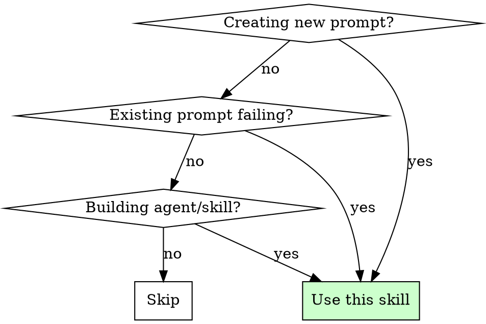
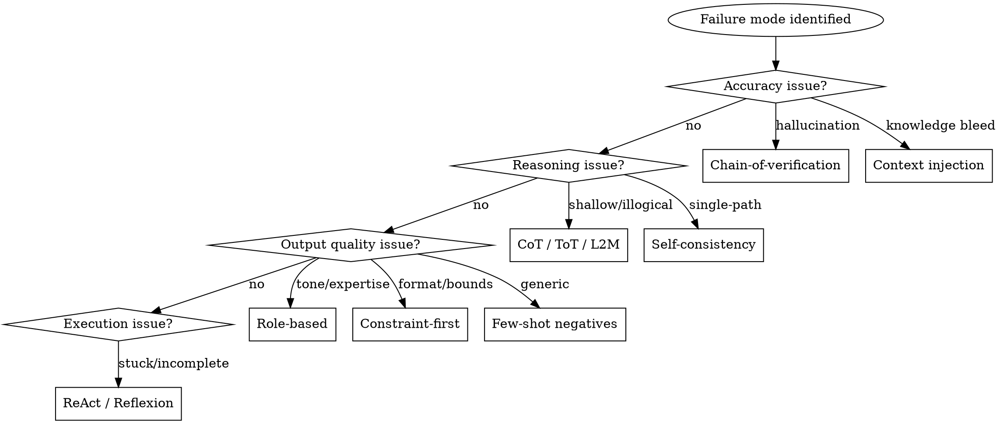

# Prompt engineering

## Overview

Transform weak prompts into precision instruments through systematic technique application.

**Core principle:** Prompts fail in predictable ways; each failure mode has research-proven countermeasures.

**Violating the letter of this process is violating the spirit of prompt engineering.**

## When to use



**Use for:**

- System prompts for agents or assistants
- Task prompts producing poor results
- Skill definitions
- User-facing prompt templates
- Automated workflow prompts

**Don't use for:**

- One-off simple questions
- Prompts already performing well
- Non-prompt content (use other skills)

## The iron law

```
NO PROMPT SHIPS WITHOUT:
DIAGNOSIS -> TECHNIQUE -> VERIFICATION
```

Guessing at improvements without diagnosing the failure mode is not prompt engineering.

## Failure mode taxonomy

Before applying any technique, identify which failure mode(s) the prompt exhibits:

### Category 1: Output quality failures

| Failure Mode | Symptoms | Primary Techniques |
|--------------|----------|-------------------|
| `VAGUE` | Ambiguous, wishy-washy, hedging | Constraint-first, Role-based |
| `GENERIC` | Template-sounding, could apply to anything | Few-shot with negatives, Directional Stimulus |
| `VERBOSE` | Unnecessary padding, repetition | Skeleton-of-Thought, Constraint-first |
| `WRONG_FORMAT` | Correct content, wrong structure | Structured thinking, Constraint-first |
| `WRONG_TONE` | Content ok, voice/style wrong | Role-based, Directional Stimulus |

### Category 2: Reasoning failures

| Failure Mode | Symptoms | Primary Techniques |
|--------------|----------|-------------------|
| `SHALLOW` | Superficial analysis, misses nuance | Structured thinking, Multi-perspective |
| `ILLOGICAL` | Steps don't follow, jumps to conclusions | Zero-Shot CoT, Least-to-Most |
| `SINGLE_PATH` | Misses alternative approaches | Tree of Thoughts, Self-consistency |
| `ARITHMETIC` | Calculation errors | PAL (Program-Aided) |
| `COMPLEX_PROBLEM` | Can't handle multi-step problems | Least-to-Most, Skeleton-of-Thought |

### Category 3: Accuracy failures

| Failure Mode | Symptoms | Primary Techniques |
|--------------|----------|-------------------|
| `HALLUCINATION` | Fabricated facts, false citations | Chain-of-verification, Context injection |
| `OUTDATED` | Uses stale information | ReAct (with tools), Generated Knowledge |
| `OVERCONFIDENT` | Wrong but confident | Confidence-weighted, Self-consistency |
| `CONTEXT_LEAK` | Uses outside knowledge when shouldn't | Context injection with boundaries |

### Category 4: Task execution failures

| Failure Mode | Symptoms | Primary Techniques |
|--------------|----------|-------------------|
| `INCOMPLETE` | Stops before finishing | Iterative refinement, Exit criteria |
| `OFF_TASK` | Answers different question | Constraint-first, Structured thinking |
| `NO_TOOLS` | Needs external data but doesn't seek it | ReAct |
| `STUCK` | Can't proceed, gives up | Reflexion, Tree of Thoughts |

## Technique selection matrix

**Quick reference for technique selection:**

| If prompt needs... | Use technique | Key benefit |
|-------------------|---------------|-------------|
| Precise expertise | Role-based constraint | Domain accuracy |
| Fact verification | Chain-of-verification | Fewer hallucinations |
| Clear boundaries | Few-shot with negatives | Fewer generic outputs |
| Deep analysis | Structured thinking | Layered reasoning |
| Decision confidence | Confidence-weighted | Explicit uncertainty |
| Bounded knowledge | Context injection | Less knowledge bleed |
| Quality iteration | Iterative refinement | Progressive improvement |
| Specific constraints | Constraint-first | Hard requirements met |
| Multiple viewpoints | Multi-perspective | Less bias |
| Self-optimization | Meta-prompting | Optimal structure |
| Consistent answers | Self-consistency | Fewer single-path errors |
| Exploration/backtrack | Tree of Thoughts | Strategic lookahead |
| Tool integration | ReAct | Grounded responses |
| Parallel structure | Skeleton-of-Thought | Speed + organization |
| Progressive complexity | Least-to-Most | Generalization |
| Targeted generation | Directional Stimulus | Specific properties |
| Self-correction | Reflexion | Learn from failures |
| Precise calculation | PAL | Zero arithmetic errors |
| Simple reasoning boost | Zero-Shot CoT | Quick improvement |
| Knowledge priming | Generated Knowledge | Better factual basis |

## The engineering process

### Phase 1: Diagnosis

**Before touching the prompt, identify failure modes:**

1. **Collect evidence**

    - Run the prompt 3-5 times
    - Document specific failures (not general impressions)
    - Note which outputs were acceptable vs. unacceptable

2. **Classify failures**

    ```
    DIAGNOSIS REPORT

    Prompt: [brief description]
    Test runs: N

    Observed failures:
    [1] <FAILURE_MODE>: <specific example>
    [2] <FAILURE_MODE>: <specific example>
    ...

    Primary failure mode: <most frequent/severe>
    Secondary failure modes: <others to address>
    ```

3. **Identify root cause**

    - Is the failure in the prompt structure?
    - Is it a missing technique?
    - Is it conflicting instructions?
    - Is it asking the impossible?

### Phase 2: Technique selection

**Match failure modes to techniques:**



**Technique stacking rules:**

- Start with ONE primary technique
- Add secondary techniques only if primary insufficient
- Maximum 3 techniques per prompt (avoid complexity)
- Techniques must be compatible (see compatibility matrix)

### Phase 3: Application

**Apply selected technique(s) systematically:**

1. **Preserve working elements**

    - Don't rewrite from scratch
    - Keep what already works
    - Add technique elements surgically

2. **Follow technique templates exactly**

    - Don't improvise on proven patterns
    - Use the documented structure
    - Modify content, not framework

3. **Layer techniques carefully**

    - Primary technique: structural changes
    - Secondary techniques: augmentations
    - Don't let techniques conflict

### Phase 4: Verification

**Test the improved prompt:**

1. **Run same test cases** that revealed original failures

2. **Compare outputs** quantitatively where possible

3. **Document improvement**:

    ```
    VERIFICATION REPORT

    Original failure rate: X/N tests
    Improved failure rate: Y/N tests

    Failure modes addressed:
    [1] <MODE>: FIXED / IMPROVED / UNCHANGED
    [2] <MODE>: FIXED / IMPROVED / UNCHANGED

    New issues introduced: [none / list]

    Verdict: SHIP / ITERATE / REVERT
    ```

4. **Iterate if needed**

    - If UNCHANGED on primary failure: try different technique
    - If new issues: revert, analyze, try again
    - If IMPROVED but not FIXED: add complementary technique

## Technique reference

### Foundation techniques

**Role-based constraint prompting**

```
You are a [specific role] with [X years] experience in [domain].
Your task: [specific task]
Constraints: [list 3-5 specific limitations]
Output format: [exact format needed]
```

*Use for: VAGUE, WRONG_TONE, expertise needed*

**Constraint-first prompting**

```
HARD CONSTRAINTS (cannot be violated):
- [constraint 1]
- [constraint 2]

SOFT PREFERENCES (optimize for these):
- [preference 1]
- [preference 2]

TASK: [your actual request]
```

*Use for: WRONG_FORMAT, OFF_TASK, specific requirements*

**Context injection with boundaries**

```
[CONTEXT]
[paste documentation, code, etc.]

[FOCUS]
Only use information from CONTEXT. If answer isn't there, say so.

[TASK]
[your question]

[CONSTRAINTS]
- Cite specific sections
- Do not use general knowledge
```

*Use for: HALLUCINATION, CONTEXT_LEAK, grounded responses*

### Reasoning techniques

**Zero-Shot Chain-of-Thought**

```
[Your question]

Let's think step by step.
```

*Use for: Quick reasoning boost, SHALLOW analysis*

**Self-consistency prompting**

```
[Your question]

Generate [N] different reasoning paths.
Show work for each path.
Identify which answer appears most frequently.
```

*Use for: SINGLE_PATH, OVERCONFIDENT, consensus needed*

**Tree of Thoughts**

```
Problem: [problem]

Step 1 - Generate 3 possible first moves
Step 2 - Evaluate each: promising / neutral / unlikely
Step 3 - Expand most promising into 3 next steps
Step 4 - Backtrack if stuck
Step 5 - Continue until solved

Show exploration tree with evaluations.
```

*Use for: COMPLEX_PROBLEM, exploration, strategic problems*

**Least-to-Most prompting**

```
Problem: [complex problem]

Step 1 - Decomposition:
Break into simpler subproblems, easiest to hardest.

Step 2 - Sequential solving:
Solve subproblem 1: [solution]
Using that, solve subproblem 2: [solution]
...continue...

Final answer: [synthesized solution]
```

*Use for: COMPLEX_PROBLEM, generalization beyond examples*

**PAL (Program-Aided Language)**

```
Problem: [problem with computation]

Write Python code to solve step by step.
Include comments explaining reasoning.
End with print(f"Answer: {answer}")

Execute code for result.
```

*Use for: ARITHMETIC errors, precise computation*

### Verification techniques

**Chain-of-verification**

```
Task: [question]

Step 1: Provide initial answer
Step 2: Generate 5 verification questions that would expose errors
Step 3: Answer each verification question
Step 4: Provide corrected final answer
```

*Use for: HALLUCINATION, OVERCONFIDENT, accuracy-critical*

**Reflexion**

```
Task: [task]

Attempt 1: [solution]

Evaluation:
- Success? [Yes/No]
- What went wrong? [issues]

Self-Reflection:
- Root cause: [why]
- Lesson: [what to change]

Attempt 2 (with lessons): [improved solution]

[Repeat until success]
```

*Use for: STUCK, iterative improvement, learning from failure*

**Confidence-weighted prompting**

```
Answer: [question]

Provide:
1. Primary answer
2. Confidence (0-100%)
3. Key assumptions
4. What would change your answer
5. Alternative if <80% confident
```

*Use for: OVERCONFIDENT, high-stakes decisions*

### Output control techniques

**Few-shot with negative examples**

```
I need you to [task]. Examples:

GOOD: [example]
GOOD: [example]

BAD: [example]
Why bad: [reason]
BAD: [example]
Why bad: [reason]

Now complete: [task]
```

*Use for: GENERIC outputs, style control*

**Structured thinking protocol**

```
Before answering, complete:

[UNDERSTAND]
- Restate problem
- Identify what's asked

[ANALYZE]
- Break into sub-components
- Note assumptions/constraints

[STRATEGIZE]
- 2-3 potential approaches
- Evaluate trade-offs

[EXECUTE]
- Final answer
- Explain reasoning

Question: [question]
```

*Use for: SHALLOW, ILLOGICAL, complex reasoning*

**Skeleton-of-Thought**

```
Question: [question]

Stage 1 - Skeleton:
List key points as brief phrases (3-7 points).
Do not elaborate.

Stage 2 - Expansion:
Expand each point into detailed paragraph.
Each self-contained.
```

*Use for: VERBOSE, speed + structure*

**Directional Stimulus prompting**

```
Task: [task]
Input: [content]

Directional stimulus:
- Keywords to include: [required]
- Tone: [style]
- Focus on: [priorities]
- Avoid: [exclusions]

Complete task incorporating stimulus above.
```

*Use for: GENERIC, specific properties needed*

### Meta techniques

**Meta-prompting**

```
I need to accomplish: [goal]

Your task:
1. Analyze what would make the PERFECT prompt
2. Consider: specificity, context, constraints, format, examples
3. Write that perfect prompt
4. Execute it and provide output

[GOAL]: [objective]
```

*Use for: Unknown optimal structure, self-optimization*

**Multi-perspective prompting**

```
Analyze [topic] from these perspectives:

[PERSPECTIVE 1: Technical Feasibility]
[PERSPECTIVE 2: Business Impact]
[PERSPECTIVE 3: User Experience]
[PERSPECTIVE 4: Risk/Security]

SYNTHESIS:
Integrate into recommendation with trade-offs.
```

*Use for: Bias reduction, strategic analysis*

**Generated Knowledge prompting**

```
Question: [question]

Step 1 - Knowledge Generation:
Generate 3-5 relevant facts that would help answer accurately.

Step 2 - Knowledge Integration:
Using ONLY generated knowledge, answer the question.
```

*Use for: Factual accuracy, self-retrieval*

**ReAct prompting**

```
Task: [question]

Use this loop:
Thought: [what info needed / what to do]
Action: [Search/Lookup/Calculate][query]
Observation: [result]

When confident:
Thought: I have enough information.
Final Answer: [answer]
```

*Use for: NO_TOOLS, needs external information*

**Iterative refinement**

```
[ITERATION 1]
Create draft of [task]

[ITERATION 2]
Review output. Identify 3 weaknesses.

[ITERATION 3]
Rewrite addressing all weaknesses.

[ITERATION 4]
Final review: Production-ready? If not, what's missing?
```

*Use for: INCOMPLETE, quality improvement*

## Technique compatibility

Some techniques work well together; others conflict:

| Technique | Combines well with | Conflicts with |
|-----------|-------------------|----------------|
| Role-based | Constraint-first, Few-shot | - |
| Constraint-first | All | - |
| Chain-of-verification | Self-consistency | - |
| Few-shot negatives | Role-based, Constraint-first | - |
| Structured thinking | Multi-perspective | Skeleton-of-Thought |
| Self-consistency | Chain-of-verification | Skeleton-of-Thought |
| Tree of Thoughts | Reflexion | Skeleton-of-Thought |
| ReAct | Generated Knowledge | PAL |
| Skeleton-of-Thought | Directional Stimulus | Multi-path techniques |
| Least-to-Most | Self-consistency | - |
| Reflexion | Tree of Thoughts | - |
| PAL | Constraint-first | ReAct |
| Zero-Shot CoT | Everything | Nothing |
| Meta-prompting | Use alone first | All (it generates its own) |

## Anti-patterns

### What not to do

| Anti-pattern | Problem | Instead |
|--------------|---------|---------|
| "Just make it better" | No diagnosis, no technique | Diagnose failure mode first |
| Technique soup | Too many techniques, conflicts | Max 3, check compatibility |
| Ignoring evidence | Not testing before/after | Always verify improvement |
| Template worship | Copying template without understanding | Understand why technique works |
| Overengineering | Complex prompt for simple task | Match complexity to problem |
| Skipping verification | Assuming improvement worked | Test same failure cases |

### Common rationalizations

| Excuse | Reality |
|--------|---------|
| "The prompt is close enough" | If it's failing, it's not close enough |
| "More examples will fix it" | Examples without negatives often fail |
| "Just add more detail" | Verbosity does not equal clarity; structure matters |
| "This technique is overkill" | Proven techniques beat intuition |
| "I'll verify later" | Unverified improvements ship bugs |
| "The model should understand" | Models need explicit structure |

## Integration with other skills

### With bureau-scrimmage-mode

For **security-critical prompts**:

1. Engineer prompt with this skill
2. Activate scrimmage mode
3. Attack the prompt (injection, jailbreak, edge cases)
4. Fix vulnerabilities found
5. Re-verify

## Quick reference

### Diagnosis

```
1. Run prompt 3-5 times
2. Document specific failures
3. Classify failure modes
4. Identify primary mode
```

### Technique selection

```
Accuracy    -> Chain-of-verification / Context injection
Reasoning   -> CoT / ToT / Least-to-Most / Self-consistency
Output      -> Role-based / Constraint-first / Few-shot negatives
Execution   -> ReAct / Reflexion
```

### Application

```
1. Preserve working elements
2. Follow templates exactly
3. Max 3 techniques
4. Check compatibility
```

### Verification

```
1. Rerun original failure cases
2. Compare quantitatively
3. Document: FIXED / IMPROVED / UNCHANGED
4. Verdict: SHIP / ITERATE / REVERT
```

## Checklist

Before shipping any engineered prompt:

- [ ] Failure modes diagnosed with evidence
- [ ] Technique(s) selected based on diagnosis
- [ ] Applied using documented templates
- [ ] Compatible techniques (max 3)
- [ ] Tested on original failure cases
- [ ] Improvement documented quantitatively
- [ ] No new failure modes introduced
- [ ] Verified by independent run

## Red flags - stop

- Applying technique without diagnosis
- Combining incompatible techniques
- Skipping verification
- "It seems better" without evidence
- More than 3 techniques stacked
- Template significantly modified
- Original failure cases not retested

**All of these mean: Go back to Phase 1.**
