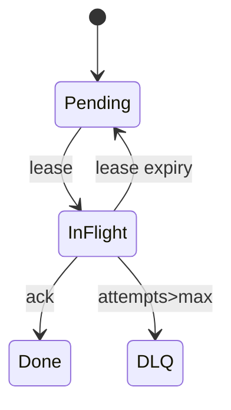
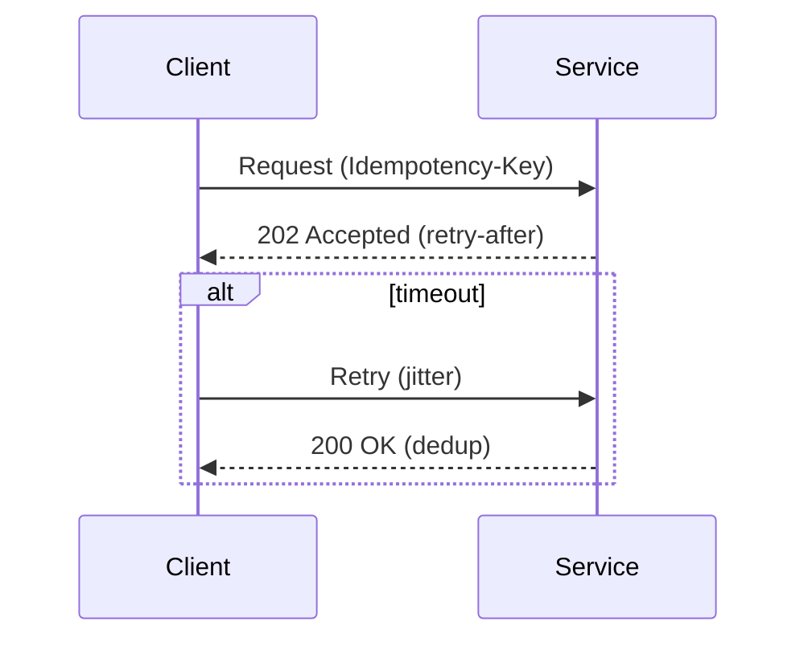

# AGENTS.md — Staff/Principal‑Level Documentation Standard

This file defines the **minimum bar** for Staff/Principal‑quality documentation, doubling as:

1. **instructions for human authors**
2. an **operating manual for coding/documentation agents** that generate or review technical docs.

---

## 0) Universal Rules (apply to every doc)
- **Be falsifiable.** Replace adjectives with **numbers** (SLOs, limits, error budgets). Always attach units.
- **State invariants and contracts.** Put them near the code/section that enforces them.
- **Name the trade‑off.** Alternatives + consequences + decision.
- **Failure‑first.** For any I/O: declare **timeouts, retries (with jitter), idempotency**.
- **Observability.** Name metrics (with units), logs (structured keys), traces (spans/tags) and link dashboards.
- **Rollout/rollback.** Canary, flags, migrations, backfills. Never ship without a **reversal path**.
- **Security & privacy.** AuthN/Z, data classification, encryption, key rotation, PII handling.
- **Terminology discipline.** One concept ⇒ one name; add a glossary.
- **RFC 2119** language for norms (MUST/SHOULD/MAY). Prefer active voice.
- **Evidence over vibes.** Link to tests, benchmarks, incidents.

---

## 1) Document Types — Required Sections & Definition of Done (DoD)

### 1.1 Design Doc / RFC (Primary)
**Sections (MUST):** Context; Goals/Non‑Goals; Tenets/Constraints; Prior Art & Alternatives; Proposed Design (APIs, Data, Algorithms, Topology, Security); Failure Modes; Observability; Performance/Capacity; Testing; Rollout/Ops; Risks & Open Questions; Decision; Appendix.
**DoD:** p95/p99 targets present; error taxonomy typed; backpressure policy explicit; cost per request estimated; rollback steps copy‑pasteable; diagrams included.

**Template (condensed):**
```md
# <Title>  
Owner: <name> · Reviewers: <names> · Status: Draft/Accepted · Updated: <YYYY‑MM‑DD>

1. Context — pain, scope, affected users (link tickets/incidents)
2. Goals / Non‑Goals — testable outcomes
3. Tenets / Constraints — SLOs, budgets, compliance
4. Alternatives — pros/cons/risks/costs
5. Proposed Design
   5.1 API — requests/responses, errors, timeouts, idempotency
   5.2 Data — schema/indexes/retention/consistency
   5.3 Control/Algorithms — state machines, backpressure, retries+jitter
   5.4 Topology — regions/AZs, failover, tenancy
   5.5 Security — authz, encryption, PII
6. Failure Modes — table: failure → detect → mitigate → impact
7. Observability — metrics (name+unit), logs, traces, dashboards/alerts
8. Performance & Capacity — workload model, targets, method, cost
9. Testing — unit, property, fuzz, chaos, soak; exit criteria
10. Rollout & Ops — flags, migrations, canary, rollback, runbooks
11. Risks & Open Questions — owners+dates
12. Decision — rationale, link ADR
Appendix — glossary, raw data, proofs
```

**Mermaid snippets:**



---

### 1.2 Architecture Decision Record (ADR)
**Sections:** Context; Decision; Consequences; Alternatives.  
**DoD:** Decision is imperative; consequences include migration/cost; status set.

**Template:**
```md
# ADR-00X <Decision>
Date: <YYYY‑MM‑DD> · Status: Proposed/Accepted/Deprecated · Owners: <names>
Context — constraints/incidents forcing choice
Decision — one paragraph
Consequences — good/bad, migrations, future limits
Alternatives — bullets, link RFC
```

---

### 1.3 Service README (Production)
**Sections:** Quickstart (≤10 min); Concepts & Invariants; API link + error taxonomy; Operability (dashboards/alerts/log keys); Limits & SLOs; Benchmarks (repro); Security; FAQ.  
**DoD:** `make run-local` + `make demo` work; SLOs & limits listed; bench reproducible.

---

### 1.4 API Reference & Guides
**Sections:** Semantics (delivery/consistency/idempotency); Errors (typed; RFC7807 if HTTP); Rate limits/pagination; Time/clock skew; Examples incl. edge cases.  
**DoD:** Every error lists remediation; examples runnable.

---

### 1.5 Runbooks
**Sections:** How to detect; First 5 minutes; Common failures table; Rollback/Recovery; Escalation.  
**DoD:** Commands copy‑pasteable; thresholds concrete; rollback tested.

---

### 1.6 Incident Postmortem
**Sections:** Summary; Timeline (UTC); Root Cause; Detection gaps; Remediation plan (owners+dates); Learnings.  
**DoD:** Action items tracked; links to graphs/logs.

---

### 1.7 Benchmarks & Experiments
**Sections:** Workload model; Environment; Method; Results table; Repro steps; Interpretation.  
**DoD:** p50/p95/p99, throughput, error rate, cost; raw data committed.

**Results skeleton:**
| Test | Setup | p95(ms) | p99(ms) | Thruput(req/s) | Errors(%) | Cost/1k |
|---|---|---:|---:|---:|---:|---:|

---

### 1.8 PR Descriptions & Commits
**PR MUST include:** Why (user impact); What changed (invariants, timeouts/backpressure); Validation (unit/prop/bench/chaos/compat); Risk & rollout; Before/after graphs.  
**Commit style:** Imperative subject ≤50 chars; body explains motivation and consequences; reference issues/ADRs.

---

### 1.9 Code Documentation
**Comment the WHY + contracts,** not the obvious HOW. Use tags:
- `INVARIANT:` must always hold
- `RATIONALE:` why this approach
- `PERF:` perf assumption/optimization
- `SECURITY:` guarantees/threats
- `COMPAT:` backward/forward guarantees
- `SAFETY:` justification (esp. Rust `unsafe`)

**Docstrings MUST specify:** semantics, arguments, returns, typed errors, timeouts, metrics emitted, SLO notes.

---

## 2) Agent Operating Procedure (AOP)

### 2.1 Required Inputs (agent MUST gather or ask for)
- Problem statement + impacted users; Goals/Non‑Goals; Constraints (SLOs, budget, compliance).  
- Existing topology/tenancy; APIs and data models; security posture.  
- Load shape; latency/throughput targets; error budget.  
- Rollout constraints (flags, migrations); on‑call expectations.  
- Prior incidents or tickets.

If any are missing, agent MUST: (a) **pause generation**, (b) output a **Missing Inputs** section with targeted questions, (c) propose sensible defaults marked `TODO` with risks.

### 2.2 Generation Rules
- Always emit **Timeouts + Retries (with full jitter) + Idempotency** for any network/storage operation.  
- Always create **Failure Modes table** and **Observability section** with metric names + units.  
- Ensure **Definitions of Done** are met per doc type.  
- Add **Alternatives** with at least one rejected option and explicit trade‑offs.  
- Insert **Rollback plan** and **cost estimate** (even rough) in RFCs.  
- Auto‑include **Mermaid** diagrams for 1 state machine and 1 sequence.

### 2.3 Validation / Lint Rules (reject if violated)
- Numbers lack **units**.  
- No p95/p99 or SLI/alert thresholds.  
- No error taxonomy or remediation guidance.  
- Missing rollback steps.  
- Undefined tenets/constraints.  
- Inconsistent terminology (same concept, multiple names).  
- Security/privacy omitted where data leaves a trust boundary.

### 2.4 Metric Naming Conventions
- **Counters:** `<svc>_<thing>_total` (e.g., `queue_enqueue_errors_total{code}`)
- **Histograms:** `<svc>_<thing>_latency_ms`
- **Gauges:** `<svc>_<thing>_inflight`
Include **labels**: `tenant`, `region`, `az`, `code`.

### 2.5 Default Policies (if none specified)
- **Timeouts:** client 1s, server 2–5s; exponential backoff 100–1600ms with **full jitter** ×3 tries.  
- **Idempotency window:** 24h with server‑side dedupe.  
- **Backpressure:** token bucket per tenant; 429 with retry‑after.  
- **SLOs:** availability 99.95%, p99 latency targets per API specified.  
- **Rate limits:** burst=2×, sustained per contract.  
Mark defaults clearly and surface risks.

---

## 3) Anti‑Patterns → Rewrites
- “Scalable” → “Handles **50k req/s** with **p99 < 200ms** at **1.5× headroom**.”
- “Highly available” → “Meets **99.95% SLO**; single‑AZ failure tolerated; RTO 10m.”
- “Simple retries” → “**3 retries**, **expo backoff + jitter**, guarded by **idempotency key**.”
- “Eventually consistent” → “R=1/W=1 with **read‑repair**; median staleness **250ms**, p99 **2.4s** under test X.”

---

## 4) Quick Checklists (paste into PRs)

**Design Doc Ready**
- [ ] Goals/Non‑Goals testable
- [ ] Failure table present
- [ ] Timeouts/retries/idempotency specified
- [ ] Metrics/logs/traces + units
- [ ] p95/p99 + cost estimate
- [ ] Rollout & rollback plan
- [ ] Alternatives with consequences

**README Ready**
- [ ] `make run-local` & `make demo`
- [ ] SLOs & limits
- [ ] Bench reproducible
- [ ] Dashboards/alerts linked

**Runbook Ready**
- [ ] First 5 minutes
- [ ] Symptom→Mitigation table
- [ ] Rollback tested
- [ ] Escalation contacts current

**Benchmark Ready**
- [ ] Workload shape defined
- [ ] Environment pinned
- [ ] p50/p95/p99, throughput, errors, cost
- [ ] Raw data + plot script
- [ ] Decision impact written

---

## 5) Minimal Glossary
- **SLI/SLO/SLA:** indicator/objective/agreement.  
- **Idempotency:** repeated operation yields the same effect.  
- **Backpressure:** mechanisms to slow producers when consumers saturate.  
- **Quorum (R/W):** replicas needed to serve reads/writes.  
- **Read‑repair:** reconcile divergent replicas on reads.  
- **DRF:** Dominant Resource Fairness across multi‑resource clusters.

---

### Final Note
If a new engineer can **operate** and **evolve** the system without pinging the author, the document meets the Staff/Principal bar. Agents should enforce this by failing validation when critical sections or numbers are missing.

